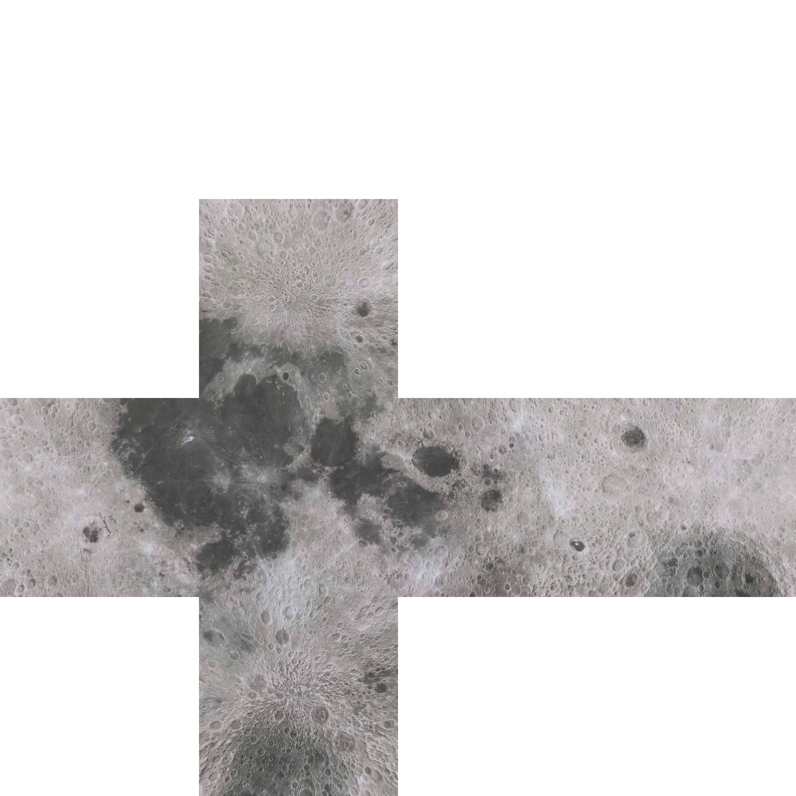

# Cubemap Generator
**Equirectangular to cubemap image converter, used in https://github.com/ostef/space-sim**

This program converts an equirectangular image to a single texture cubemap. It is multithreaded.

Usage: gen_cubemap input_file0 input_file1 ... input_filen output_folder

